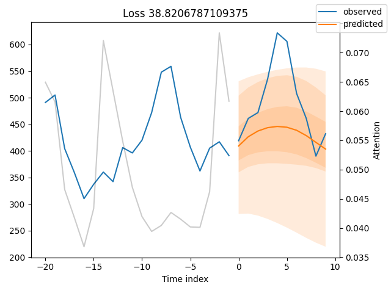
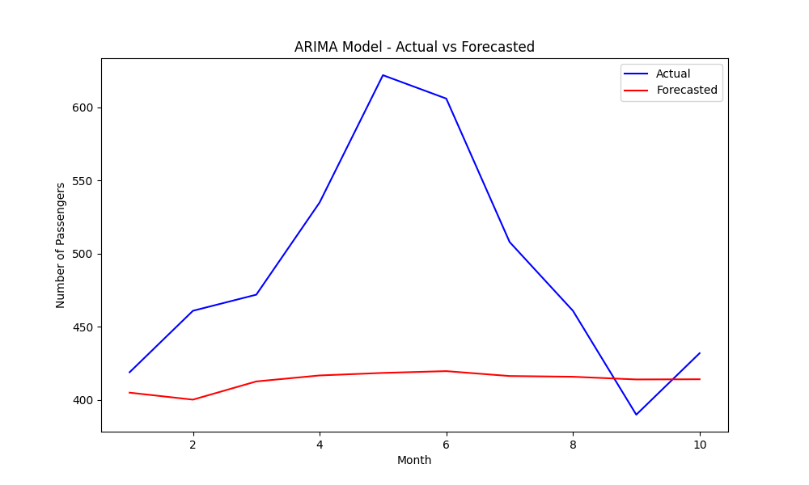

# Time Series Forecasting Mini Project


A mini time series forecasting project using the classic **Sunspots** dataset from `statsmodels.datasets`. The goal is to implement and compare different forecasting models:  

- Temporal Fusion Transformer (TFT) ✅
- ARIMA
- DeepAR

---

## Project Overview

This project focuses on forecasting sunspot activity using multiple models:

1. **Temporal Fusion Transformer (TFT)** – a deep learning model for interpretable multi-horizon time series forecasting.
2. **ARIMA** – a classical statistical model for univariate time series.
3. **SARIMA** - a classical statistical model for seasonal time series

TFT is implemented, here is the result:

### Training Loss Figure (TFT)


ARIMA is implemented, here is the result:

### Training Loss Figure (TFT)

---

## Installation

Clone the repository:

```bash
git clone git@github.com:rezaghasemi/ts_mini_project.git
cd ts_mini_project
```

Create a virtual environment and install dependencies:

```bash
python -m venv venv
source venv/bin/activate  # On Windows: venv\Scripts\activate
pip install -r requirements.txt
```

## Libraries

- **pytorch-forecasting**, **pytorch-lightning** – for deep learning models (TFT)  
- **statsmodels** – for ARIMA and dataset loading  
- **pandas**, **numpy**, **matplotlib** – data handling and visualization  
- **mlflow** – experiment tracking  


## Project Status

- **TFT implemented** ✅  
- **ARIMA implementation**: ✅  
- **SARIMA implementation**: Pending


## License

This project is licensed under the [MIT License](https://opensource.org/licenses/MIT).
